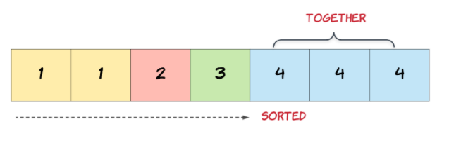

# Leetcode Array Problem Solutions
## 1)	Remove Duplicates from Sorted Array

Given a sorted array nums, remove the duplicates in-place such that each element appears only once and returns the new length.
Do not allocate extra space for another array, you must do this by modifying the input array in-place with O(1) extra memory.

In this problem, the key point to focus on is the input array being sorted. As far as duplicate elements are concerned, what is their positioning in the array when the given array is sorted? Look at the image above for the answer. If we know the position of one of the elements, do we also know the positioning of all the duplicate elements?


 
```
class RemoveDuplicates {
    public static int removeDuplicates(int[] nums) {
        int length = nums.length;
        if(length == 0){
            return 0;
        }
        int i;
        int targetIndex = 1;
        int comp = nums[0];
        
        for(i=1;i<length;i++){
            if(nums[i] != comp){
                comp = nums[i];
                nums[targetIndex] = nums[i];
                targetIndex++;
                
            }
        }
        return targetIndex;
    }
    public static void main(String args[]){
        int nums[] = {1,1,2};
        int len = removeDuplicates(nums);
        System.out.println("Array size after removing duplicates is "+len);
    }

}
```

> Input: nums = [1,1,2]

> Output: Array size after removing duplicates is 2


## 2)	Best Time to Buy and Sell Stock II

Say you have an array prices for which the ith element is the price of a given stock on day i.
Design an algorithm to find the maximum profit. You may complete as many transactions as you like (i.e., buy one and sell one share of the stock multiple times).

Note: You may not engage in multiple transactions at the same time (i.e., you must sell the stock before you buy again).

```
public class StocksMaxProfit {
    public static int maxProfit(int[] prices) {
        int length = prices.length;
        if(length == 0){
            return 0;
        }
        boolean b = false;
        boolean s = true;
        int buy = 0;
        int sell = 0;
        int profit = 0;
        for(int i=0;i<length-1;i++){
            int j=i+1;
            if(prices[i]<prices[j] && s == true){
                buy = prices[i];
                b = true;
                s = false;
            }
            if(prices[i]>prices[j] && b == true){
                sell = prices[i];
                b = false;
                s = true;
                profit = profit + (sell - buy);
            }       
        }
        if(s == false){
            sell = prices[length-1];
            profit = profit + (sell - buy);
        }
        return profit;
    }
    public static void main(String args[]){
        int prices[] = {1,2,3,4,5};
        int prof = maxProfit(prices);
        System.out.println("Maximum Profit is "+prof);
    }
}
```

> Input: [1,2,3,4,5]

> Output: Maximum Profit is 4

## 3)	Rotate Array

Given an array, rotate the array to the right by k steps, where k is non-negative.

```
import java.util.*; 
public class RotateArray {
    public static int[] rotate(int[] nums, int k) {
       
        int l = nums.length;
        
        for (int j = 0; j < k; j++){
            
            int i, temp; 
            temp = nums[l-1]; 
            for (i = l-1; i > 0 ; i--) 
                nums[i] = nums[i - 1]; 
            nums[0] = temp;
        }
        
        return nums;
    }
    public static void main(String args[]){
        int nums[] = {1,2,3,4,5,6,7};
        int k = 3;
        int n[] = rotate(nums,k);
        System.out.println("Array after rotation: "+ Arrays.toString(n));
    }
}
```

> Input: nums = [1,2,3,4,5,6,7], k = 3

> Output: [5,6,7,1,2,3,4]

## 4)	Contains Duplicate

Given an array of integers, find if the array contains any duplicates.

Your function should return true if any value appears at least twice in the array, and it should return false if every element is distinct.

```
import java.util.HashMap; 
public class Duplicate {
    public static boolean containsDuplicate(int[] nums) {
        int l = nums.length;
        HashMap<Integer, Integer> map = new HashMap<>();
        
        boolean duplicate = false;
        
        for(int i=0; i<l; i++){
            if(map.containsKey(nums[i])){
                duplicate = true;
                return duplicate;
            }else{
                map.put(nums[i], i);
            }
        }
        return duplicate;      
    }
    public static void main(String args[]){
        int nums[] = {1,2,3,1};
        boolean ans = containsDuplicate(nums);
        System.out.println(ans);
    }
}
```

> Input: [1,2,3,1]

> Output: true

## 5)	Single Number

Given a non-empty array of integers nums, every element appears twice except for one. Find that single one.

```
import java.util.HashMap;
public class SingleNumber {
    public static int singleNumber(int[] nums) {
        int l = nums.length;
        HashMap<Integer, Integer> map = new HashMap<>();
        HashMap<Integer, Integer> map2 = new HashMap<>();
        int s = 0;
        for(int i=0; i<l; i++){
            if(!map.containsKey(nums[i])){
                map.put(nums[i], i);
            }else{
                map2.put(nums[i], i);
            }
        }
        for(int i=0; i<l; i++){
            if (!map2.containsKey(nums[i])) {
                    s=nums[i];
                    return s;
            }
        }
        return s;
    }
    public static void main(String args[]){
        int nums[] = {4,1,2,1,2};
        int single = singleNumber(nums);
        System.out.println(single);
    }
}
```

> Input: nums = [4,1,2,1,2]

> Output: 4


